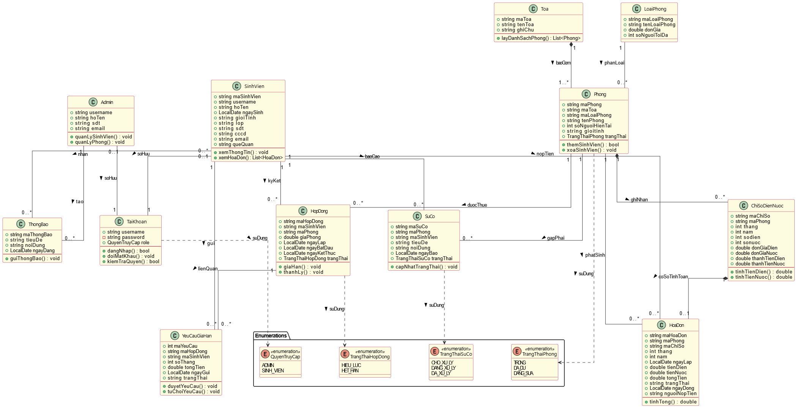
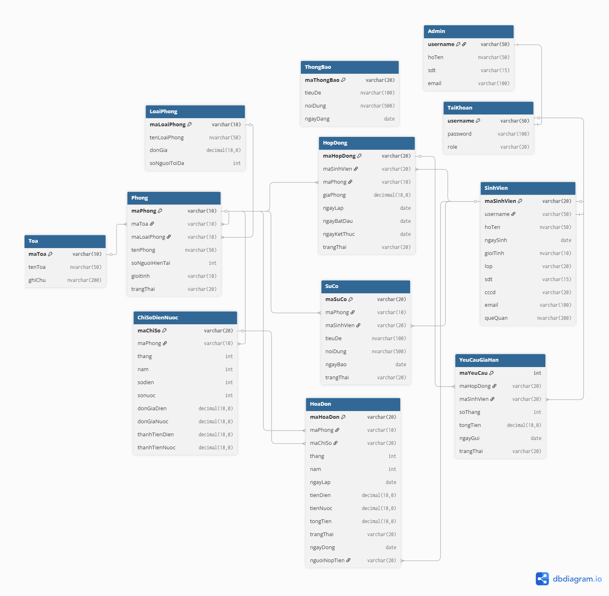

# Phần Mềm Quản Lý Ký Túc Xá PTIT (DormManagement)

## 1. Giới Thiệu
**DormManagement** là hệ thống phần mềm quản lý ký túc xá được xây dựng dành riêng cho Học viện Công nghệ Bưu chính Viễn thông (PTIT). Ứng dụng giúp số hóa quy trình quản lý, từ việc xếp phòng, quản lý hợp đồng, tính toán điện nước đến việc tiếp nhận và xử lý sự cố, giúp ban quản lý tiết kiệm thời gian và nâng cao hiệu quả công việc. 

Chi tiết xem thêm tại [docs của dự án (đang cập nhật)](https://docs.google.com/document/d/1p1yCRwZPHPiE018SR1CzKuirQsjd96QzvHBwBb2Fhas/edit?usp=sharing)

## 2. Công Nghệ Sử Dụng
Dự án được phát triển dựa trên các công nghệ hiện đại và ổn định:
*   **Ngôn ngữ lập trình:** Java 21
*   **Giao diện người dùng (GUI):** JavaFX 21
*   **Quản lý dự án & Build tool:** Maven
*   **Cơ sở dữ liệu:** Microsoft SQL Server
*   **Driver kết nối:** MSSQL JDBC Driver
*   **Mô hình kiến trúc:** MVC (Model-View-Controller) kết hợp Service Layer.
    *   **Model:** Đại diện cho dữ liệu và các quy tắc nghiệp vụ (Entities).
    *   **View:** Hiển thị dữ liệu và tương tác với người dùng (FXML).
    *   **Controller:** Tiếp nhận yêu cầu từ View, xử lý và cập nhật Model.
    *   **Service Layer:** Chứa các logic nghiệp vụ phức tạp, giúp giảm tải cho Controller và tăng tính tái sử dụng.

## 3. Tính Năng Chính

### Dành cho Quản trị viên (Admin)
*   **Quản lý Sinh viên:** Thêm, sửa, xóa, tìm kiếm thông tin sinh viên.
*   **Quản lý Phòng:** Quản lý trạng thái phòng (Trống, Đã đủ, Đang sửa chữa), loại phòng, tòa nhà.
*   **Quản lý Hợp đồng:** Tạo mới, gia hạn, thanh lý hợp đồng thuê phòng.
*   **Quản lý Điện nước:** Ghi chỉ số điện nước hàng tháng, tự động tính tiền.
*   **Quản lý Hóa đơn:** Tạo và theo dõi trạng thái thanh toán hóa đơn.
*   **Quản lý Sự cố:** Tiếp nhận báo cáo hỏng hóc từ sinh viên và cập nhật trạng thái xử lý.
*   **Quản lý Yêu cầu gia hạn:** Duyệt hoặc từ chối yêu cầu gia hạn hợp đồng từ sinh viên.
*   **Thông báo:** Đăng tải các thông báo chung cho toàn bộ ký túc xá.

### Dành cho Sinh viên
*   **Thông tin cá nhân:** Xem thông tin hồ sơ, phòng ở hiện tại.
*   **Hợp đồng của tôi:** Xem chi tiết hợp đồng, thời hạn hợp đồng.
*   **Hóa đơn:** Xem danh sách hóa đơn cần thanh toán và lịch sử thanh toán.
*   **Báo cáo sự cố:** Gửi yêu cầu sửa chữa cơ sở vật chất hỏng hóc.
*   **Đăng ký gia hạn:** Gửi yêu cầu gia hạn hợp đồng trực tuyến.
*   **Xem thông báo:** Cập nhật tin tức mới nhất từ ban quản lý.

## 4. Cấu Trúc Dự Án
Dự án được tổ chức theo cấu trúc chuẩn Maven:

```
DormManagement/
├── docs/                       # Tài liệu và Script SQL
│   ├── Tao_bang.sql            # Script tạo bảng CSDL
│   ├── Nhap_du_lieu.sql        # Dữ liệu mẫu cơ bản (20 SV)
│   └── Nhap_du_lieu_large.sql  # Dữ liệu mẫu lớn (200 SV)
├── generate_data.py            # Tool Python sinh dữ liệu giả lập
├── src/
│   └── main/
│       ├── java/com/dorm/
│       │   ├── controller/     # Các lớp điều khiển (JavaFX Controllers)
│       │   ├── model/          # Các lớp thực thể (Entities)
│       │   ├── service/        # Các lớp xử lý nghiệp vụ (Business Logic)
│       │   ├── database/       # Lớp quản lý kết nối CSDL
│       │   ├── util/           # Các tiện ích chung
│       │   ├── view/           # Các lớp hỗ trợ giao diện
│       │   └── Main.java       # Điểm khởi chạy ứng dụng
│       └── resources/
│           ├── config/         # File cấu hình (application.properties)
│           ├── css/            # File định dạng giao diện
│           ├── fxml/           # File giao diện người dùng (.fxml)
│           └── image/          # Hình ảnh, icon, logo
├── pom.xml                     # Cấu hình Maven dependencies
└── README.md                   # Tài liệu hướng dẫn
```

## 5. Mô hình Lớp (Class Diagram)


## 6. Cơ Sở Dữ Liệu
Hệ thống sử dụng **SQL Server**.



*   **Sơ đồ quan hệ (ERD):** Bao gồm các bảng chính như `SinhVien`, `Phong`, `HopDong`, `HoaDon`, `ChiSoDienNuoc`, `SuCo`, `ThongBao`, `YeuCauGiaHan`, `TaiKhoan`, `Admin`.
*   **Script khởi tạo:** Nằm trong thư mục `docs/`.

## 7. Hướng Dẫn Cài Đặt & Sử Dụng
### Yêu cầu hệ thống
*   JDK 21 trở lên.
*   Maven 3.x.
*   SQL Server (2019 hoặc mới hơn).

### Bước 1: Chuẩn bị Cơ sở dữ liệu
1.  Mở SQL Server Management Studio (SSMS).
2.  Tạo một database mới tên là `DormManagement`.

### Bước 2: Cấu hình kết nối
1.  Mở file `src/main/resources/config/application.properties`.
2.  Cập nhật thông tin kết nối phù hợp với máy của bạn:
    ```properties
    database.url=jdbc:sqlserver://localhost;databaseName=DormManagement;encrypt=true;trustServerCertificate=true
    database.username=sa
    database.password=your_password
    ```

### Bước 3: Khởi tạo Bảng & Dữ liệu
Bạn có thể chọn 1 trong 2 cách sau:

**Cách 1: Chạy Script SQL (Thủ công)**
1.  Chạy script `docs/Tao_bang.sql` để tạo cấu trúc bảng.
2.  Chạy script `docs/Nhap_du_lieu.sql` (20 SV) hoặc `docs/Nhap_du_lieu_large.sql` (200 SV).

**Cách 2: Sử dụng Tool (Tự động)**
1.  Chạy file Java: `src/main/java/com/dorm/database/DatabaseBootstrapper.java`.
2.  Tool sẽ tự động kết nối, tạo bảng và nạp dữ liệu mẫu cơ bản.

### Bước 4: Chạy ứng dụng
Sử dụng lệnh Maven hoặc chạy trực tiếp từ IDE:
```bash
mvn clean javafx:run
```

### Bước 5: Đăng nhập
Sử dụng bộ dữ liệu mẫu để đăng nhập:

*   **Tài khoản Quản trị viên (Admin):**
    *   Username: `admin`
    *   Password: `admin`

*   **Tài khoản Sinh viên:**
    *   Username: `B20DCCN001` (hoặc bất kỳ mã SV nào từ `B20DCCN001` đến `B20DCCN200`)
    *   Password: `123`

## 8. Đóng Góp
Mọi đóng góp cho dự án đều được hoan nghênh. Vui lòng thực hiện theo các bước sau:
1.  Fork dự án.
2.  Tạo branch tính năng mới (`git checkout -b feature/AmazingFeature`).
3.  Commit thay đổi (`git commit -m 'Add some AmazingFeature'`).
4.  Push lên branch (`git push origin feature/AmazingFeature`).
5.  Tạo Pull Request.

## 9. Giấy Phép
Dự án này được phân phối dưới giấy phép MIT. Xem file `LICENSE` để biết thêm chi tiết.
